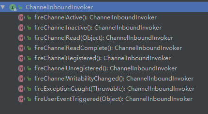
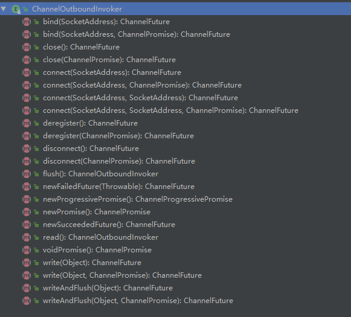

如上图所示， Channel 的handler 被 ChannelPipleLine组织为一个双向链表： 链表的节点是HandlerContext，Handler包含在HandlerContext中。

链表的头节点是一个HeadContext类型的HandlerContext， 它包含了一个Channel.Unsafe的实例引用，出站事件如connect, bind,read,write等最终是通过头节点的Unsafe实例实现的。

链表的尾节点是一个TailContext类型的HandlerContext， 可以将它视为一个什么也不做的占位节点（毒丸对象），入站事传递到这个节点上什么也不做结束方法调用，出站事件从这个节点开始，调用前一个节点对应的出站方法。


### ChannelInboundInvoker & ChannelOutboundInvoker

ChannelInboundInvoker 定义了所有的的入站方法，如下图所示



ChannelOutboundInvoker 定义了所有的出站方法，如下力所示


- ChannelPipeline 与 ChannelHandlerContext 都继承了ChannelInboundInvoker和ChannelOutboundInvoker，

- Channel 只继承了ChannelOutboundInvoker 


通过 AbstractChannel 的源码可知，Channel的出站方法实质上也是调用了 ChannelPipeLine对应的出站方法。


netty 中 ChannelPipeline 的实现是 DefaultChannelPipelie。 阅读源码可知，对于

- 出站方法，都是从tail开始调用context对应的方法
- 入站方法，都是从head开始调用context的对应方法

### ChannelInboundHandler & ChannelOutboundHandler

参考下面的类图


ChanelHandler 中只定义了Handler 是3个生命周期方法。

子接口ChannelInboundHandler 定义了响应入站事件的方法， 与 ChannelInboundInvoker 入站方法是相对应的。

子接口ChannelOutboundHandler 定义了触发出站事件的方法， 与ChannelOutboundInvoker中的出站方法是相对应的。


几个主要的Handler实现，ChannelInboundHandlerAdapter，ChannelOutboundHandlerAdapter，ChannelDuplexHandler，都是将方法调用委托给了HandlerContext对应的方法。 如果我们自己去实现一些Handler 的话，如果不需要事件继续往后走，就不需要再调用context对应的方法了， 如果需要后续Handler继续处理，则一定不要忘记调用context对应的方法。


## ChannelContext

channelContext 的实现主要在 AbstractChannelHandlerContext中，

入站方法以fireChannelRead 为例：

```java
    @Override
    public ChannelHandlerContext fireChannelRead(final Object msg) {
        // 找到下一个入站ctx,并调用下一个入站ctx的 invokeChannelRead 方法
        invokeChannelRead(findContextInbound(), msg);
        return this;
    }

    private AbstractChannelHandlerContext findContextInbound() {
        // 找到下一个入站ctx, 最后一个入站ctx是 tailContext 
        AbstractChannelHandlerContext ctx = this;
        do {
            ctx = ctx.next;
        } while (!ctx.inbound);
        return ctx;
    }
    static void invokeChannelRead(final AbstractChannelHandlerContext next, Object msg) {
        final Object m = next.pipeline.touch(ObjectUtil.checkNotNull(msg, "msg"), next);
        EventExecutor executor = next.executor();
        // 调用 next ctx 的invokeChannelRead 方法，
        // 如果当前线程是本channel绑定的线程直接执行
        // 如果不是则加入到绑定线程的任务队列中
        if (executor.inEventLoop()) {
            next.invokeChannelRead(m);
        } else {
            executor.execute(new Runnable() {
                @Override
                public void run() {
                    next.invokeChannelRead(m);
                }
            });
        }
    }


    private void invokeChannelRead(Object msg) {
        
        if (invokeHandler()) {
        	// 如果handler 就绪，则执行handler 的 channelRead() 方法
            try {
                ((ChannelInboundHandler) handler()).channelRead(this, msg);
            } catch (Throwable t) {
                notifyHandlerException(t);
            }
        } else {
            // 如果handler 未就绪，则直接调用本ctx的fireChannelRead方法（向后传递事件）
            fireChannelRead(msg);
        }
    }
```

由上面代码可知，调用ctx的fireXXX()方法，其实质上就是调用下一个入站事件handler对应的  XXX()方法。 在handler中继续调用其绑定的ctx的fireXXX()方法就会将事件在整个链路上传递下去，直到tailContext。


对于出站事件由以 write为例：

```java
abstract class AbstractChannelHandlerContext extends DefaultAttributeMap
        implements ChannelHandlerContext, ResourceLeakHint {
    @Override
    public ChannelFuture write(final Object msg, final ChannelPromise promise) {
        if (msg == null) {
            throw new NullPointerException("msg");
        }

        try {
            if (isNotValidPromise(promise, true)) {
                ReferenceCountUtil.release(msg);
                // cancelled
                return promise;
            }
        } catch (RuntimeException e) {
            ReferenceCountUtil.release(msg);
            throw e;
        }
        write(msg, false, promise);

        return promise;
    }
    private void write(Object msg, boolean flush, ChannelPromise promise) {
    	// 取得调用链上前面一个出站ctx
        AbstractChannelHandlerContext next = findContextOutbound();
        final Object m = pipeline.touch(msg, next);
        EventExecutor executor = next.executor();
        
        // 调用下一个出站ctx的 invokeWrite/invokeWriteAndFlush方法
        if (executor.inEventLoop()) {
            if (flush) {
                next.invokeWriteAndFlush(m, promise);
            } else {
                next.invokeWrite(m, promise);
            }
        } else {
            final AbstractWriteTask task;
            if (flush) {
                task = WriteAndFlushTask.newInstance(next, m, promise);
            }  else {
                task = WriteTask.newInstance(next, m, promise);
            }
            if (!safeExecute(executor, task, promise, m)) {
                task.cancel();
            }
        }
    }
    
    private AbstractChannelHandlerContext findContextOutbound() {
        // 寻找下一个出站ctx，从后向前找，最后一个是headContext
        AbstractChannelHandlerContext ctx = this;
        do {
            ctx = ctx.prev;
        } while (!ctx.outbound);
        return ctx;
    }
    
    private void invokeWrite(Object msg, ChannelPromise promise) {
        if (invokeHandler()) {
            // 若handler就绪，调用handler的write 方法
            invokeWrite0(msg, promise);
        } else {
            // 若handler未就绪，调用本ctx的write 方法，向前传递msg
            write(msg, promise);
        }
    }
    private void invokeWrite0(Object msg, ChannelPromise promise) {
        try {
            // 调用本ctx 绑定的handler的write 方法
            ((ChannelOutboundHandler) handler()).write(this, msg, promise);
        } catch (Throwable t) {
            notifyOutboundHandlerException(t, promise);
        }
    }
}

// 调用链路的头节点
final class HeadContext extends AbstractChannelHandlerContext
            implements ChannelOutboundHandler, ChannelInboundHandler {

        private final Unsafe unsafe;

       // .....
        @Override
        public void write(ChannelHandlerContext ctx, Object msg, ChannelPromise promise) throws Exception {
           // 最终会调用到channel的unsafe.wirte方法
            unsafe.write(msg, promise);
        }
    	// .....
    }
```


由上面代码可知，调用ctx的 XXX()出站方法，其实质上就是调用前面一个出站handler对应的  XXX()方法。 在handler中继续调用其绑定的ctx的XXX()方法就会将事件在整个链路上传递下去，直到HeadContext。

